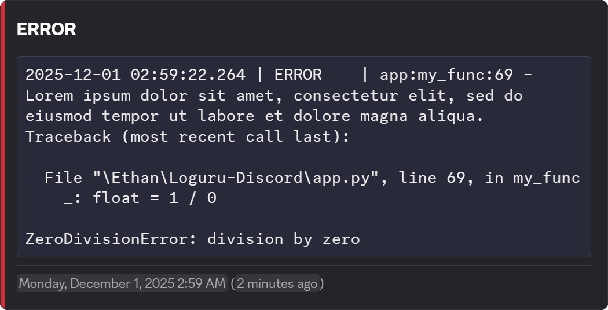

# Loguru-Discord

Loguru-Discord forwards [Loguru](https://github.com/Delgan/loguru) logs to [Discord](https://discord.com/) through the Webhook API. Choose `DiscordSink` for synchronous delivery or `AsyncDiscordSink` for bounded, native async delivery. Both support plain messages, rich Components V2 output, custom usernames and avatars, thread targeting, and exception suppression.

## Installation

Loguru-Discord requires **Python 3.11 or later**.

Install with [uv](https://docs.astral.sh/uv/):

```console
uv add loguru-discord
```

Or install with pip:

```console
pip install loguru-discord
```

## Quickstart

Replace the placeholder URL with your Discord webhook URL, then run:

```python
from loguru import logger
from loguru_discord import DiscordSink

logger.add(DiscordSink("https://discord.com/api/webhooks/00000000/XXXXXXXX"))
logger.info("Application started")
```

The default output is a plain message containing the formatted log record in a Markdown code block. Loguru's existing console sink stays active. Each record is sent synchronously; pass `enqueue=True` to `logger.add()` if you want Loguru to queue delivery in a background thread.

All webhook options are keyword arguments on [DiscordSink](sink.md) and [AsyncDiscordSink](async_sink.md).

## Async quickstart

Use an async context manager to initialize and close the sink on one event loop:

```python
from loguru import logger
from loguru_discord import AsyncDiscordSink


async def main():
    async with AsyncDiscordSink(
        "https://discord.com/api/webhooks/00000000/XXXXXXXX", rich=True
    ) as sink:
        handler_id = logger.add(sink, enqueue=False)
        try:
            logger.info("Application started")
            # Await application work here.
            await logger.complete()
        finally:
            logger.remove(handler_id)
```

`enqueue=False` lets the sink's bounded buffer control admission. Logging returns without waiting for HTTP, retry sleeps, or buffer capacity. The sink accepts up to 1,000 pending records and 16 MiB of UTF-8 text by default, including the active delivery. It drops the newest record at either limit and reports aggregated overflow notifications. Read `sink.statistics` for delivery counters, or supply an out-of-band `on_error` callback. See [async lifecycle and overflow handling](async_sink.md).

The non-blocking delivery guarantee applies to `AsyncDiscordSink`. Other handlers on the same logger must also be configured for the application's latency requirements. Loguru's `enqueue=True` remains available for `DiscordSink`; its pipe-backed queue can block producers under backpressure, and its completion and removal wait for the queue worker.

Both sinks have finite default connection/read timeouts, retry limits, and delivery budgets. See [transport limits](transport.md) for configuration and synchronous versus async timeout semantics.

## Rich output

Set `rich=True` to show the level heading, a colored container, and Discord timestamps alongside the log body:

```python
from loguru import logger
from loguru_discord import DiscordSink

sink = DiscordSink(
    "https://discord.com/api/webhooks/00000000/XXXXXXXX",
    username="Application logs",
    rich=True,
)
logger.add(sink)

try:
    value = 1 / 0
except ZeroDivisionError:
    logger.exception("Calculation failed")
```



`username` overrides the webhook's display name. When omitted, Discord uses the webhook's configured name.

### Accent colors

Each level has a separate color option. Use a hexadecimal string or integer to set a color, or `None` to remove that level's accent:

```python
from loguru import logger
from loguru_discord import DiscordSink

logger.add(
    DiscordSink(
        "https://discord.com/api/webhooks/00000000/XXXXXXXX",
        rich=True,
        error_color="FF0000",
        warning_color=0xFFAA00,
        info_color=None,
        trace_color="808080",
    )
)
logger.warning("Disk space is low")
```

| Level | Option | Default |
| --- | --- | --- |
| CRITICAL | `critical_color` | `"000000"` |
| ERROR | `error_color` | `"D22D39"` |
| WARNING | `warning_color` | `"CE9C5C"` |
| SUCCESS | `success_color` | `"43A25A"` |
| INFO | `info_color` | `"FFFFFF"` |
| DEBUG | `debug_color` | `"5865F2"` |
| TRACE | `trace_color` | `None` |

Colors apply only when `rich=True`. Omitted options retain their defaults.

## Avatars

`avatar_url` sets an image URL for each log message through Clyde's [`Webhook.set_avatar_url()`](https://clyde.e3n.im/webhook/#clyde.webhook.Webhook.set_avatar_url):

```python
from loguru import logger
from loguru_discord import DiscordSink

logger.add(
    DiscordSink(
        "https://discord.com/api/webhooks/00000000/XXXXXXXX",
        avatar_url="https://example.com/avatar.png",
    )
)
```

`avatar` changes the webhook's default avatar through Clyde's [`Webhook.modify()`](https://clyde.e3n.im/webhook/#clyde.webhook.Webhook.modify). It accepts the same inputs as Clyde:

| Input | Effect |
| --- | --- |
| Image data URI string | Sets the default avatar from the encoded image. |
| PNG/JPEG/GIF image bytes | Clyde encodes the image and sets the default avatar. |
| `pathlib.Path` | Clyde reads and encodes the image file, then sets the default avatar. |
| `None` | Clears the default avatar. |
| Omitted or `msgspec.UNSET` | Leaves the default avatar unchanged. |

For a local image file:

```python
from pathlib import Path

from loguru import logger
from loguru_discord import DiscordSink

logger.add(
    DiscordSink(
        "https://discord.com/api/webhooks/00000000/XXXXXXXX", avatar=Path("avatar.png")
    )
)
```

Use `Path` for local files and `avatar_url` for hosted image URLs. An `avatar` string must contain an image data URI, such as `data:image/png;base64,...`.

Supplying `avatar` makes one HTTP request during initialization and changes the webhook's default avatar for **all senders using that webhook**. File, image-format, and HTTP errors propagate from initialization. Omitting `avatar` or passing `msgspec.UNSET` skips that request. Subsequent log records do not re-read or re-upload the image.

For `AsyncDiscordSink`, initialization happens during `await sink.start()` or context entry. Clyde's `modify_async()` reads and encodes `Path` and bytes avatars in a worker thread, while HTTP uses native async transport. The constructor performs neither operation. Startup cancellation or failure closes the sink and propagates to the caller.

Both options can be supplied together: `avatar` sets the default, and `avatar_url` overrides it on this sink's messages. With `avatar_url=None`, Discord uses the webhook's default avatar.

## Threads

Pass `thread_id` to send logs to an existing thread in the webhook's channel:

```python
from loguru import logger
from loguru_discord import DiscordSink

logger.add(
    DiscordSink(
        "https://discord.com/api/webhooks/00000000/XXXXXXXX",
        thread_id="123456789012345678",
    )
)
logger.info("Sent to the logging thread")
```

A supplied `thread_id` overrides a `thread_id` query parameter in the webhook URL. If the argument is `None`, Clyde uses any thread ID in the URL. See Discord's [Execute Webhook documentation](https://docs.discord.com/developers/resources/webhook#execute-webhook) for thread requirements.

## Exception suppression

Use `suppress` to skip records carrying specified exception types, including subclasses:

```python
from loguru import logger
from loguru_discord import DiscordSink

logger.add(
    DiscordSink(
        "https://discord.com/api/webhooks/00000000/XXXXXXXX",
        suppress=[ZeroDivisionError],
    )
)

try:
    value = 1 / 0
except ZeroDivisionError:
    logger.exception("This record stays out of Discord")
```

Suppression applies only to this Discord sink. Other Loguru sinks still receive the record. A record must carry exception information, as `logger.exception()` or `logger.opt(exception=...)` provides; mentioning an exception in the message text does not suppress it.

## Long messages

Plain output falls back to a **`message.txt` attachment** when the body exceeds Discord's 2,000-character content limit, including Markdown code-block fences.

Rich output uses the same fallback when the body, level heading, and timestamps exceed the 4,000-character Components V2 text limit, including Markdown formatting. The oversized record is sent as a plain webhook payload without Components V2 flags. Subsequent records that fit the limit keep their rich formatting.

The attachment contains the complete formatted log record, including any traceback, encoded as UTF-8 without code-block fences. Messages are not truncated.

## Standard-library logging

Set `intercept=True` to route standard-library logging through Loguru and its configured sinks:

```python
import logging

from loguru import logger
from loguru_discord import DiscordSink

logger.add(
    DiscordSink(
        "https://discord.com/api/webhooks/00000000/XXXXXXXX",
        intercept=True,
        intercept_level_map={"NOTICE": "INFO"},
    )
)

logging.info("This record also reaches Loguru")
logging.addLevelName(25, "NOTICE")
logging.log(25, "Custom level mapped to INFO")
```

Enabling interception calls [Intercept.setup()](intercept.md#loguru_discord.intercept.Intercept.setup). It **replaces and closes existing root logging handlers** and sets the root logging level to `0`. Named loggers keep their own levels and handlers; records must propagate to the root logger to reach this interceptor. Configure interception once during application startup.

To configure interception separately from a Discord sink, call `Intercept.setup(level_map={"NOTICE": "INFO"})`. Recognized Loguru level names are used directly. Unrecognized names fall back to the record's numeric level. Records emitted during webhook delivery are ignored by the interceptor to avoid recursive logging.

## API reference

- [DiscordSink](sink.md): constructor options and webhook delivery.
- [AsyncDiscordSink](async_sink.md): bounded admission, initialization, draining, and shutdown.
- [Transport limits](transport.md): request policy defaults, exceptions, and cancellation.
- [Intercept](intercept.md): level mapping and standard-library logging setup.

## Releases and contributing

See [GitHub releases](https://github.com/EthanC/Loguru-Discord/releases) for version history and release notes. Loguru-Discord loosely follows [Semantic Versioning](https://semver.org/).

Read the [contributor guide](https://github.com/EthanC/Loguru-Discord/blob/main/.github/CONTRIBUTING.md) for local development and documentation commands. Report bugs and request features in the [issue tracker](https://github.com/EthanC/Loguru-Discord/issues).

Loguru-Discord is not affiliated with or endorsed by Loguru or Discord.
